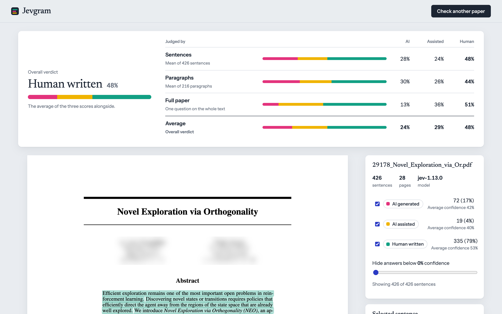
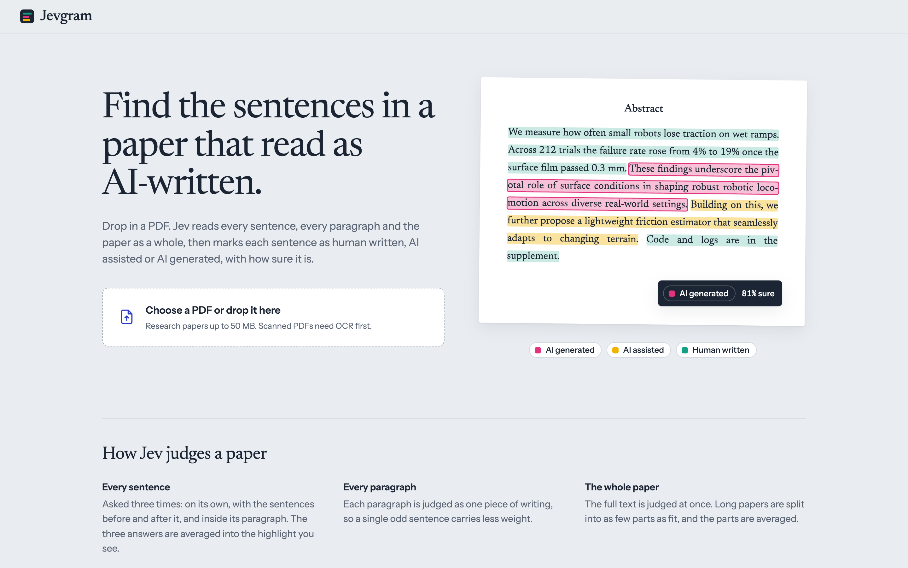
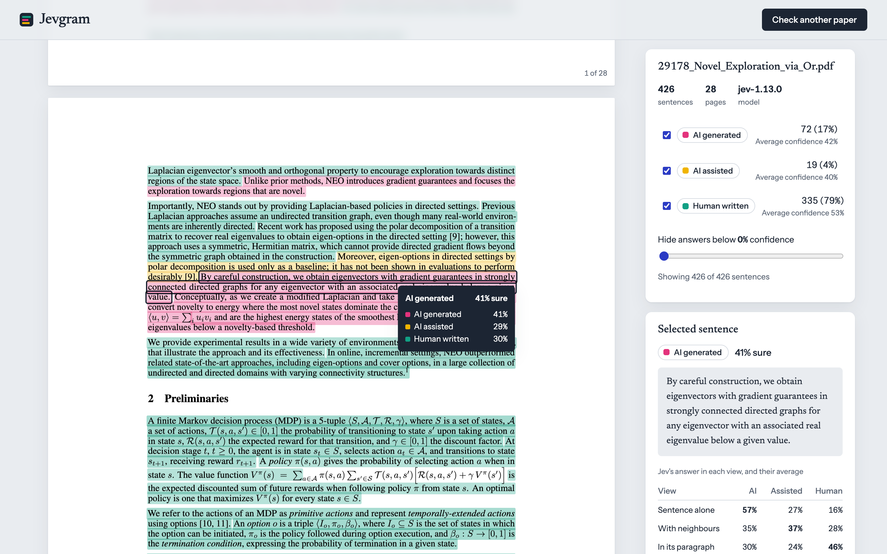
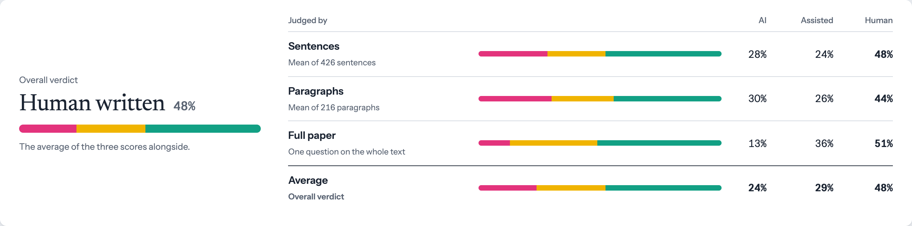
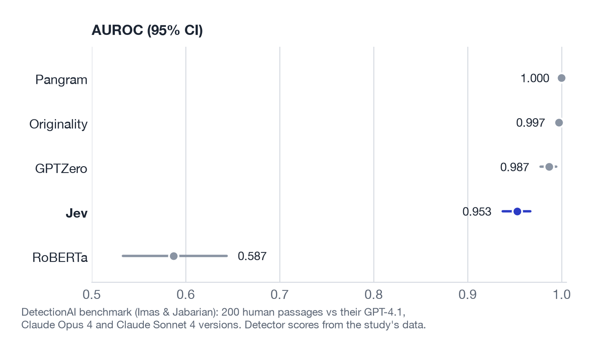

<div align="center">

# Jevgram

**See which sentences in a research paper read as human written, AI assisted or AI generated.**

Drop in a PDF. [Jev](https://typesafe.ai), TypeSafe's System One model, judges every sentence,
every paragraph and the whole paper, and Jevgram draws the result right on the pages.



<sub>A published NeurIPS 2025 paper, author names blurred.</sub>

</div>

---

## What you get

- **Highlights on the real pages.** Every sentence is coloured by its label, and the colour
  gets stronger the surer Jev is. Hover for the numbers; click for the full breakdown.
- **An overall verdict** built from three independent readings of the paper: sentence by
  sentence, paragraph by paragraph, and the whole text at once.
- **Filters** to show only one label, or hide answers below a confidence you choose.
- **A benchmark** against Pangram, Originality, GPTZero and RoBERTa on published data,
  so you can see how far to trust it (see [How well does it work?](#how-well-does-it-work)).

<table>
<tr>
<td width="50%"></td>
<td width="50%"></td>
</tr>
<tr>
<td><sub>Drop a PDF on the landing page.</sub></td>
<td><sub>Click any sentence to see how each view judged it.</sub></td>
</tr>
</table>

## How it works

Jevgram asks Jev one plain question, with no hints about what AI text looks like:

> How was this written? **fully AI written** / **AI assisted** / **fully human written**

Jev answers with a probability for each option. Jevgram asks it at three levels:

| Level | What Jev sees | How it is combined |
|---|---|---|
| **Sentence** | The sentence alone, then with the sentence before and after it, then inside its paragraph | The three answers are averaged into the sentence's highlight |
| **Paragraph** | Each paragraph as one piece of writing | Averaged over all paragraphs, each counting once |
| **Whole paper** | The full text at once (long papers are split into as few parts as fit Jev's 32k-token window) | The parts are averaged |

The **overall verdict** is the average of the sentence, paragraph and whole-paper scores, and
the verdict band shows all three so the arithmetic is visible:



Before any of that, Jevgram turns the PDF into clean sentences with
[PyMuPDF](https://pymupdf.readthedocs.io): it drops the title block, reference list, chart
labels, page numbers and review-copy line numbers, rejoins sentences split by columns,
figures and page breaks, and keeps the position of every line so the highlights land exactly
on the text. The pages themselves are drawn in the browser with [pdf.js](https://mozilla.github.io/pdf.js/).

## Quick start

You need Python 3.12+, [uv](https://docs.astral.sh/uv/) and a TypeSafe API key.

```bash
git clone https://github.com/sandroandric/JevGram.git
cd JevGram
cp .env.example .env
```

Open `.env` and paste your key after `TYPESAFE_API_KEY=`. You can create a key at
[console.typesafe.ai](https://console.typesafe.ai/). Never commit `.env`; it is already in
`.gitignore`.

```bash
uv run python -m jevgram
```

Open <http://127.0.0.1:8000> and drop in a paper. A typical 10–30 page paper takes a few
seconds and costs about one US cent of Jev usage.

### Settings

All settings live in `.env`:

| Variable | Default | Purpose |
|---|---|---|
| `TYPESAFE_API_KEY` | (none) | Your TypeSafe key. Required. |
| `JEVGRAM_MODEL` | `jev-latest` | Pin a version such as `jev-1.13.0` to keep results stable when Jev updates |
| `JEVGRAM_HOST` | `127.0.0.1` | Address the app listens on |
| `JEVGRAM_PORT` | `8000` | Port the app listens on |

### Use it from code

The web page is a thin client over one endpoint:

```bash
curl -F file=@paper.pdf http://127.0.0.1:8000/api/analyze
```

The JSON response holds every sentence with its label, confidence, per-view probabilities
and highlight rectangles (in PDF points), plus the `overview` with the sentence, paragraph,
paper and overall scores.

## How well does it work?

We ran Jev on the benchmark from Imas & Jabarian's
[DetectionAI study](https://github.com/brianjabarian/DetectionAI): 200 human passages written
before 2020 (news, novels, blogs, résumés, restaurant and product reviews), each paired with
versions written by GPT-4.1, Claude Opus 4 and Claude Sonnet 4. The commercial detectors'
scores come from the study's own data, on exactly the same texts.

Like the commercial detectors, Jev judges each passage as a whole, with the same plain question
the app uses.



| Detector | AUROC (95% CI) | AI caught at 1% false positives | at 5% |
|---|---|---|---|
| Pangram | 1.000 | 98.8% | 99.8% |
| Originality | 0.997 | 92.2% | 98.6% |
| GPTZero | 0.987 | 98.3% | 98.3% |
| **Jev** | **0.953** (0.937–0.967) | **63.7%** | **72.3%** |
| RoBERTa (open source) | 0.587 | 2.5% | 4.0% |

**Reading it honestly:** Jev ranks AI text above human text most of the time with a single
plain question and no detection-specific training, far ahead of the open-source baseline.
The purpose-built commercial detectors are clearly stronger, especially at strict settings
where almost no human text may be flagged. Scoring all 800 texts cost about two US cents of
Jev usage.

Reproduce it (Jev results are cached in `benchmarks/results/`, so a rerun costs nothing):

```bash
git clone https://github.com/brianjabarian/DetectionAI.git ../DetectionAI
uv run python -m benchmarks.detectionai --data ../DetectionAI
uv run --with matplotlib python -m benchmarks.plot_detectionai
```

## Limitations

Please read these before relying on a result.

- **A label is a judgment, not proof.** Human writing is sometimes labeled AI, and AI
  writing sometimes passes as human. Do not use Jevgram as the sole basis for decisions
  about a person.
- **Single sentences are noisy.** Short sentences give Jev little to go on, and a sentence
  near the boundary between two labels can change label between runs. The paragraph and
  whole-paper scores are more stable than any single highlight.
- **The benchmark is not research papers.** It covers news, fiction, blogs, résumés and
  reviews, and fully AI-written texts rather than AI-assisted ones, so it says little about
  how Jevgram does on academic writing that was only polished with AI.
- **PDF text is imperfect.** Formulas lose their layout, some sentences around display
  equations come out as fragments, and scanned PDFs need OCR first.
- **English works best.** Jev's primary training language is English.
- **Your text leaves your machine.** The PDF stays local, but the extracted text is sent to
  the TypeSafe API for judging.

## Project layout

```
jevgram/
  app.py            FastAPI app: upload endpoint and static files
  pdf_extract.py    PDF to sentences, paragraphs and highlight rectangles
  labeling.py       Jev questions: sentence views, paragraphs, whole paper, overview
  static/           The web page (HTML, CSS, JS)
benchmarks/
  detectionai.py    Benchmark against the DetectionAI study
  plot_detectionai.py
  results/          Metrics, per-passage scores and cached Jev answers
tests/              Offline tests plus one live test that runs when a key is set
docs/images/        README images
```

## Development

```bash
uv run pytest
```

The tests run offline with a fake Jev client. `tests/test_live.py` also calls the real API
when `TYPESAFE_API_KEY` is set.

## Credits

- [Jev](https://typesafe.ai) and the TypeSafe SDK for every judgment.
- Alex Imas and Brian Jabarian for the [DetectionAI](https://github.com/brianjabarian/DetectionAI) benchmark data.
- [PyMuPDF](https://pymupdf.readthedocs.io) for PDF text extraction and [pdf.js](https://mozilla.github.io/pdf.js/) for rendering.

## License

Jevgram's code is released under the [MIT License](LICENSE). It depends on
[PyMuPDF](https://pymupdf.readthedocs.io), which is licensed under AGPL-3.0; if you
distribute Jevgram or offer it as a network service, PyMuPDF's terms apply to that combined
work.
